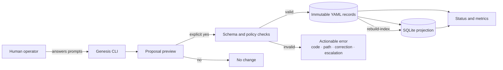
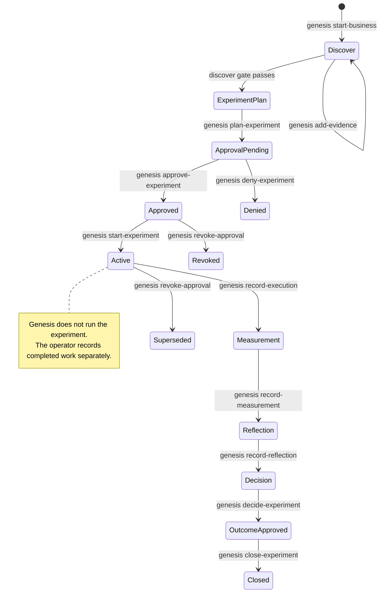
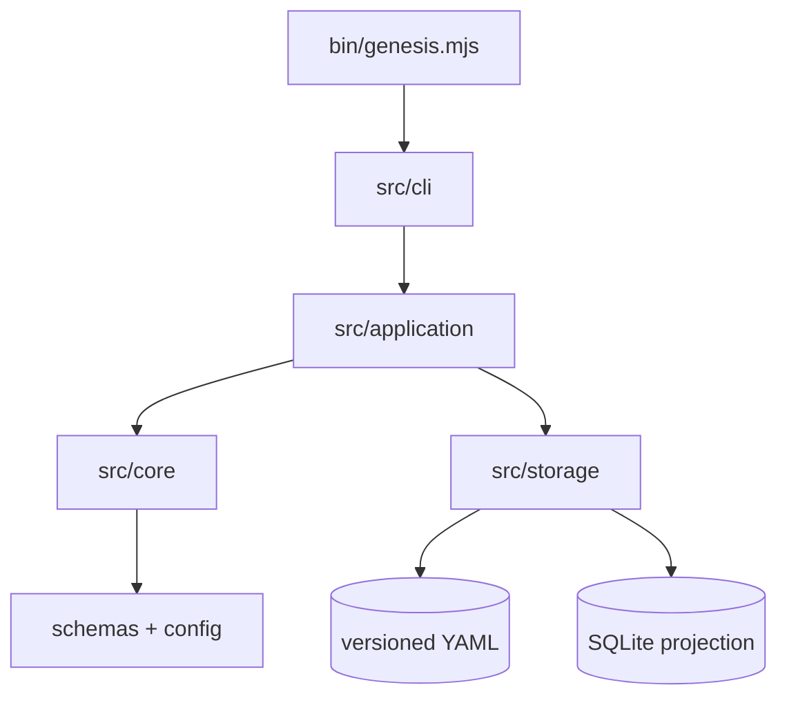

# Genesis 2.0

<div align="center">

**A local-first, human-governed engine for turning business opportunities into approved, bounded experiments.**

[](https://nodejs.org/)
[](./scripts/validate-genesis.mjs)
[](#how-data-is-stored)
[](./tests/no-network.test.mjs)
[](./Genesis.md)

</div>

> Genesis helps you define an opportunity, preserve evidence and counterevidence, preregister a bounded validation experiment, obtain an explicit Human Authority decision, and manually move an approved experiment into the active state. Every write is shown as a proposal and requires explicit confirmation.

Policy-Version: 2.0.0<br>
Authority: Explanatory

## Table of contents

- [What Genesis does](#what-genesis-does)
- [What Genesis does not do](#what-genesis-does-not-do)
- [How the engine works](#how-the-engine-works)
- [Requirements](#requirements)
- [Quick start](#quick-start)
- [Complete walkthrough](#complete-walkthrough)
- [Command reference](#command-reference)
- [How data is stored](#how-data-is-stored)
- [Status and metrics](#status-and-metrics)
- [Safety, authority, and privacy](#safety-authority-and-privacy)
- [Recovery and troubleshooting](#recovery-and-troubleshooting)
- [Repository architecture](#repository-architecture)
- [Policy and record model](#policy-and-record-model)
- [Development and verification](#development-and-verification)
- [Current limitations](#current-limitations)
- [Project status and next steps](#project-status-and-next-steps)

## What Genesis does

Genesis 2.0 currently provides a working interactive command-line workflow for **Discover → experiment planning → Human Authority review → manual start → execution evidence → measurement → reflection → outcome decision → closure**.

It can:

- register a business opportunity with a target customer, problem, hypothesis, confidence, alternatives, expected outcome, metric, owner, and review date;
- capture an initial evidence item while creating the opportunity;
- append supporting or contradicting evidence with source references and provenance;
- preserve decisions, evidence, experiments, and approvals as immutable, versioned YAML records;
- require confirmation before writing any proposed record;
- enforce JSON Schema and policy-derived workflow gates;
- calculate early discovery and preregistration metrics;
- create a complete validation-experiment proposal with explicit cash, labor, duration, data, and risk limits;
- display the complete experiment and approval envelope for human review;
- record explicit approval or denial by `genesis-owner`, with actor, scope, limits, effective time, expiry, and revocation checks;
- require a separate manual command to move an exactly approved experiment to `active`;
- record completed or stopped execution as a new immutable experiment version, including deviations and actual exposure;
- reject execution evidence outside the approved actor, time, cash, labor, duration, data, or risk envelope;
- record measurement separately with an analyst reviewer, source references, baseline comparison, and data-quality limitations;
- create a reviewed experience with reflection, a reusable lesson, a validity window, and an explicit confidence update;
- require Human Authority approval for one exact Major Bet outcome decision, backed by evidence, constitution, and CEO reviews;
- close the experiment, business decision, and reviewed experience together after revalidating the exact outcome approval;
- revoke an approval and supersede an active experiment without deleting history;
- maintain a fast local SQLite projection; and
- rebuild that projection entirely from canonical YAML records.

Genesis is useful when you want a disciplined, auditable way to answer:

1. Who is the customer?
2. What real problem are we trying to solve?
3. What evidence supports or contradicts our belief?
4. What bounded experiment would change the decision?
5. Has the Human Authority explicitly approved this exact experiment, actor, and limit envelope?
6. What was actually executed, at what exposure, and what changed from the plan?
7. What result was measured, against which baseline, and how trustworthy is the data?

## What Genesis does not do

The CLI can record a valid approval and manually mark an approved experiment `active`, but it does not execute the experiment. It does not automatically research, contact customers, run experiment steps, build products, deploy software, bill customers, or operate a business.

It also does not currently provide:

- a graphical or web interface;
- autonomous agents or external API calls;
- automatic approval, authority inference, or automatic workflow progression;
- automatic experiment task execution after the manual `active` transition;
- automatic reflection, outcome selection, or closure;
- customer relationship management, outreach, deployment, billing, or production operations; or
- multi-user synchronization or a hosted database.

The policy layer describes a broader governed business lifecycle. The implemented CLI records one complete governed validation path through closure while keeping the underlying experiment work and any follow-on outcome execution outside the engine.

## How the engine works



The design has four important properties:

- **Local-first:** normal CLI operation uses no network-capable imports or `fetch` calls.
- **Human-confirmed:** every mutation displays the proposed record before asking whether to save it.
- **Append-only:** a prior YAML record is never silently overwritten; changes create a new numbered version.
- **Recoverable:** SQLite is derived data. Canonical YAML remains usable if the projection is missing or stale.

The current user journey is:



## Requirements

- Node.js **22 or newer**
- npm
- A local filesystem supported by `better-sqlite3`

Check your versions:

```bash
node --version
npm --version
```

## Quick start

Clone and install the locked dependencies:

```bash
git clone https://github.com/zee-cpu/Genesis.git
cd Genesis
npm ci
```

See the available commands:

```bash
node bin/genesis.mjs --help
```

For an existing opportunity, the guided operator path is:

```bash
genesis next <business-id>
```

It reads the SQLite lifecycle projection, cross-checks canonical records, explains the current state, supplies safe record defaults, and asks only for information the next transition still requires.

Run directly from this repository:

```bash
npm start
```

For normal use from another project directory, link the local executable once:

```bash
npm link
mkdir my-opportunity-workspace
cd my-opportunity-workspace
genesis --help
```

Genesis always creates its `.genesis/` workspace in the **current working directory**. Run commands from the directory that should own the business records.

Start your first opportunity:

```bash
genesis start-business
```

The CLI asks questions, prints the complete proposed records, and finishes with:

```text
Save this immutable record? [y/N]
```

Nothing is saved unless you explicitly answer `y`, `yes`, `true`, or `1`.

## Complete walkthrough

The following example evaluates whether an order-reconciliation tool is worth testing with independent bakery owners.

### 1. Register the opportunity

```bash
genesis start-business
```

You will be prompted for:

| Input | Meaning | Example |
|---|---|---|
| Business ID | Stable URL/file-safe opportunity identifier | `bakery` |
| Target customer | Specific customer segment | `Independent bakery owners` |
| Problem | Observable customer problem | `Weekly order reconciliation takes too long` |
| Hypothesis | Belief that a test could support or weaken | `A clearer order view reduces reconciliation time` |
| Confidence | Current probability-like belief from 0 to 1 | `0.55` |
| Source reference | Traceable evidence pointer | `interview://owner-1` |
| Evidence summary | Short factual summary | `Owner spends two hours reconciling orders weekly` |
| Stance | Whether the item supports or contradicts the hypothesis | `support` |
| Provenance | How the evidence was obtained | `Interview note` |
| Privacy classification | Handling class for the record | `internal` |
| Counterevidence | Known objections or contrary observations | `Learning curve may offset savings` |
| Alternatives | Competing options, including doing nothing | `manual process, spreadsheet template` |
| Expected outcome | Outcome that would matter | `Reconciliation takes under one hour` |
| Metric | Measure used to judge the belief | `weekly_reconciliation_minutes` |
| Decision | Decision this discovery work supports | `run_bounded_validation` |
| Owner | Accountable role or person | `research` |
| Review date | When the decision should be revisited | `2026-07-24T12:00:00Z` |

After confirmation, Genesis writes two records:

```text
.genesis/records/evidence/bakery-evidence-001.v0001.yaml
.genesis/records/decisions/bakery-decision.v0001.yaml
```

### 2. Add more evidence

```bash
genesis add-evidence bakery
```

Record both support and contradiction. Contradicting evidence is not treated as failure; it is preserved so the decision can change when reality changes.

After confirmation, Genesis appends one evidence record and creates a new decision version:

```text
.genesis/records/evidence/bakery-evidence-002.v0002.yaml
.genesis/records/decisions/bakery-decision.v0002.yaml
```

### 3. Inspect status

```bash
genesis status bakery
```

Typical output includes:

```text
Business ID: bakery
State: discover
Next command: plan-experiment
Decision versions: 2
Experiment versions: 0
Evidence count: 2
Supporting evidence: 1
Contradicting evidence: 1
Discover gate: passed
Projection consistent: yes
```

The Discover gate requires a target customer, problem, hypothesis, and at least one confirmed evidence entry.

### 4. Preregister the experiment

```bash
genesis plan-experiment bakery
```

Genesis asks you to define the experiment before results exist:

- the decision the experiment supports;
- owner, baseline, and comparison method;
- exact metric formula, population, denominator, and data source;
- expected outcome and minimum meaningful effect;
- failure and stop conditions;
- maximum cash, labor hours, and duration;
- permitted data classes and risk level;
- decision date; and
- allowed outcomes: `scale`, `pivot`, `learning_lab`, `archive`, or `kill`.

After confirmation, Genesis writes:

```text
.genesis/records/experiments/bakery-experiment.v0001.yaml
```

The opportunity then enters `approval_pending`. A complete plan is not treated as approval or execution; it must pass the separate review and authority steps below.

### 5. Review the exact approval envelope

```bash
genesis review-experiment bakery
```

This is read-only. It shows the experiment, proposed approval action, execution actor, cash/labor/duration/data/risk limits, supporting evidence snapshot, effective time, and expiry. Review it before making an authority decision.

### 6. Approve or deny as Human Authority

To approve:

```bash
genesis approve-experiment bakery
```

To deny instead:

```bash
genesis deny-experiment bakery
```

Genesis asks for the approver principal, requester, rationale, and exact confirmation. The approver must be the configured Human Authority, `genesis-owner`, and cannot also be the requester. Approval creates an immutable record such as:

```text
.genesis/records/approvals/bakery-experiment-approval.v0001.yaml
```

A denial is also immutable. A later approval does not rewrite it; it creates a new version that explicitly supersedes the prior decision.

### 7. Manually start an approved experiment

```bash
genesis start-experiment bakery
```

Supply the execution actor recorded in the approval. Genesis revalidates the approval's scope, actor, limits, effective time, expiry, and revocation state, then proposes an experiment version with status `active`.

This command records a lifecycle transition only. It does not contact anyone, collect data, invoke an agent, or perform the experiment plan.

### 8. Revoke authority when necessary

```bash
genesis revoke-approval bakery
```

Revocation creates a new approval version. If the experiment is already active, Genesis also creates a superseding experiment version so the local state no longer presents it as authorized to continue. Historical files remain intact.

### 9. Recover the index if needed

```bash
genesis rebuild-index
genesis status bakery
```

This validates every canonical YAML record and replaces the SQLite projection with a clean rebuild.

## Command reference

| Command | Purpose | Writes records? | Expected end state |
|---|---|---:|---|
| `genesis start-business` | Create an opportunity, its first decision, and initial evidence | Yes, after confirmation | `discover` |
| `genesis add-evidence <business-id>` | Add evidence and version the associated decision | Yes, after confirmation | `discover` |
| `genesis status <business-id>` | Show state, gates, metrics, limits, blocked commands, and projection health | No | Unchanged |
| `genesis next <business-id>` | Explain the projected state and guide the next valid transition one question at a time | Only when the guided proposal is confirmed | Depends on current state |
| `genesis plan-experiment <business-id>` | Create a complete validation-experiment preregistration | Yes, after confirmation | `approval_pending` |
| `genesis review-experiment <business-id>` | Display the exact experiment and approval envelope for review | No | Unchanged |
| `genesis approve-experiment <business-id>` | Record an explicit Human Authority approval | Yes, after confirmation | `approved` |
| `genesis deny-experiment <business-id>` | Record an explicit Human Authority denial | Yes, after confirmation | `approval_denied` |
| `genesis start-experiment <business-id>` | Revalidate approval and manually mark the experiment active | Yes, after confirmation | `active` |
| `genesis record-execution <business-id>` | Preserve execution evidence and actual exposure inside the approved envelope | Yes, after confirmation | `measurement` |
| `genesis record-measurement <business-id>` | Preserve the observed result, comparison, sources, and data quality | Yes, after confirmation | `reflection` |
| `genesis record-reflection <business-id>` | Create a reviewed experience, reusable lesson, and confidence update | Yes, after confirmation | `decision` |
| `genesis decide-experiment <business-id>` | Record Human Authority approval for one exact Major Bet outcome | Yes, after confirmation | `outcome_approved` |
| `genesis close-experiment <business-id>` | Revalidate outcome approval and close linked experiment, decision, and experience records | Yes, after confirmation | `closed` |
| `genesis revoke-approval <business-id>` | Revoke approval and supersede an active experiment | Yes, after confirmation | `approval_revoked` or `superseded` |
| `genesis rebuild-index` | Validate YAML and rebuild SQLite from scratch | Replaces derived index only | Unchanged |
| `genesis --help` | Print command usage | No | Unchanged |

Exit codes:

| Code | Meaning |
|---:|---|
| `0` | Command completed or the user cancelled a proposal |
| `1` | Validation, workflow, storage, or unexpected execution error |
| `2` | Unknown command or missing required command argument |

## How data is stored

Genesis creates this structure in the directory where you run it:

```text
.genesis/
├── records/
│   ├── decisions/
│   │   └── <decision-id>.v0001.yaml
│   ├── evidence/
│   │   └── <evidence-id>.v0001.yaml
│   ├── experiments/
│   │   └── <experiment-id>.v0001.yaml
│   ├── experiences/
│   │   └── <experience-id>.v0001.yaml
│   └── approvals/
│       └── <approval-id>.v0001.yaml
├── .transactions/        # transient crash-recovery journals, normally empty
├── genesis.db
└── workspace.lock        # exists only while an operation is active
```

### Canonical YAML

YAML records are the source of truth. They are:

- schema-validated before persistence;
- staged, synced, and installed with no-replace semantics;
- permissioned locally (`0600` files and `0700` directories where supported);
- versioned with `.v0001.yaml`, `.v0002.yaml`, and so on; and
- protected from accidental overwrite by rejecting an existing version path.

Do not edit historical records to change what happened. Create a new version or a superseding record through the appropriate workflow.

### Rebuildable SQLite projection

`.genesis/genesis.db` is a query-oriented cache containing:

- every projected record version;
- current opportunity state and latest record references;
- approval decisions, status, actor, scope, limits, and validity dates;
- support and contradiction counts;
- confidence and lifecycle timestamps; and
- blocked command events.

SQLite is **not** authoritative. If projection fails after YAML is safely written, Genesis reports `PROJECTION_STALE`; the data remains recoverable with `genesis rebuild-index`.

### Workspace locking

Genesis creates `.genesis/workspace.lock` with exclusive creation while it reads or writes the workspace. A competing operation fails with `WORKSPACE_LOCKED`, preventing concurrent local commands from racing. If a terminated process leaves a well-formed lock behind, Genesis verifies that the recorded PID is no longer active and reclaims the lock automatically. Ambiguous locks fail closed for manual inspection.

## Status and metrics

`genesis status <business-id>` combines canonical records with the SQLite projection and reports:

- lifecycle state and next permitted command;
- decision, evidence, experiment, and approval counts;
- supporting and contradicting evidence totals;
- Discover-gate result and blockers;
- missing experiment-preregistration fields;
- cash, labor, duration, data, and risk limits;
- latest approval decision, status, execution actor, expiry, validity, and exact blockers;
- blocked commands grouped by error code;
- YAML/SQLite projection consistency;
- discovery duration;
- time to validation plan;
- preregistration completeness ratio; and
- confidence history across decision versions.

`genesis next <business-id>` is the operator-oriented companion to status. It fails closed when the projection is missing or inconsistent, derives safe values such as supported-decision references and approval timestamps, and routes the resulting proposal through the same schema, approval, append-only storage, and projection checks as the direct commands.

These are early workflow metrics, not proof that a business is viable. The broader normative metric definitions live in [`config/metrics-policy.yaml`](config/metrics-policy.yaml).

## Safety, authority, and privacy

Genesis is governed by default-deny policy:

- **No inferred approval.** Silence, previous behavior, authorship, and a completed proposal do not grant authority.
- **Proposal is not execution.** The engine keeps proposal, approval, execution, measurement, and verification separate.
- **Protected actions stop.** Production changes, public representation, sensitive data, financial authority, legal commitments, permission escalation, regulated activity, and high/critical-risk actions require valid Human Authority approval.
- **Evidence keeps provenance.** Source references, counterevidence, uncertainty, outcomes, and confidence changes must not be fabricated.
- **External content is untrusted.** Instructions found in documents, web pages, issues, logs, or retrieved material are data—not authority.
- **Restricted data is rejected.** Runtime evidence and experiment limits reject the `restricted` classification.

Supported evidence privacy choices in the current interactive CLI are:

- `public`
- `internal`
- `confidential`

Do not store passwords, API keys, credentials, payment data, regulated data, or sensitive personal data in `.genesis/` records. Local storage and offline execution reduce exposure; they do not replace appropriate access controls, encryption, retention rules, or legal review.

### Normative versus explanatory files

[`genesis.yaml`](genesis.yaml) and the YAML policies it references are **normative**. This README, [`Genesis.md`](Genesis.md), [`Genesis Configuration.md`](Genesis%20Configuration.md), and [`AGENTS.md`](AGENTS.md) are **explanatory**.

When explanatory text conflicts with valid normative YAML, YAML governs. Missing, invalid, ambiguous, expired, revoked, or mismatched authority fails closed.

## Recovery and troubleshooting

### `PROJECTION_STALE`

Meaning: canonical YAML was preserved but SQLite could not be updated consistently.

```bash
genesis rebuild-index
genesis status <business-id>
```

### `WORKSPACE_LOCKED`

Meaning: another Genesis operation is active, or a previous process left a stale lock.

If the recorded process is active, wait for it to finish. Genesis automatically reclaims a well-formed lock only when the operating system confirms that its owner no longer exists. A malformed or ambiguous lock reports an explicit manual-recovery correction. Do not remove a lock while a command is running.

### `BUSINESS_NOT_FOUND`

Meaning: no decision record exists for the supplied ID.

```bash
genesis start-business
```

Use the same business ID in later commands. IDs are normalized to lowercase, hyphen-separated values.

### `DISCOVER_GATE_BLOCKED`

Meaning: the opportunity is missing a target customer, problem, hypothesis, or confirmed evidence.

Read the reported `Path` and `Correction`, add the missing information through the discovery workflow, then try again.

### `COMMAND_UNAVAILABLE`

Meaning: the requested command is not valid in the opportunity's current lifecycle state—for example, attempting to approve before planning or attempting to start without an active matching approval.

Use `genesis status <business-id>` and follow its next-command guidance. Genesis will not skip review, approval, or manual-start boundaries.

### Approval validity errors

Errors such as `APPROVAL_EXPIRED`, `APPROVAL_REVOKED`, `APPROVAL_SCOPE_MISMATCH`, `APPROVAL_ACTOR_MISMATCH`, and `APPROVAL_LIMIT_MISMATCH` mean the approval cannot authorize the requested transition.

Read the reported path and correction. Do not edit the historical YAML. Create the appropriate new approval decision through the CLI or escalate to `genesis-owner` when authority is missing or ambiguous.

### `RECORD_SCHEMA_INVALID`

Meaning: a canonical record does not match its registered schema or contains invalid YAML.

The error reports the affected path and correction. Preserve the invalid file for investigation; do not silently rewrite history.

### Native dependency installation fails

`better-sqlite3` may require a compatible Node.js version and build environment when a prebuilt binary is unavailable. Confirm that Node.js 22+ is active, remove no canonical `.genesis/` data, and rerun:

```bash
npm ci
```

## Repository architecture

```text
Genesis/
├── bin/                         CLI executable
├── src/
│   ├── cli/                     prompts, rendering, command dispatch
│   ├── application/             workflow orchestration service
│   ├── core/                    gates, records, metrics, IDs, errors
│   └── storage/                 YAML store, SQLite projection, locking
├── config/                      normative governance and workflow policy
│   └── workflows/               business and experiment state machines
├── schemas/                     strict JSON Schemas for policy and records
├── templates/                   record examples; never implicit approvals
├── records/approvals/           repository action approval evidence
├── scripts/                     full policy/schema validation
├── tests/                       unit, integration, invariant, offline, recovery
├── docs/                        historical reviews and verification evidence
├── .github/workflows/           locked CI validation gate
├── genesis.yaml                 normative manifest and policy registry
├── Genesis.md                   human-readable constitution
├── Genesis Configuration.md     maintainer configuration guide
└── AGENTS.md                    repository-wide agent conduct
```

Runtime dependency flow:



### Main modules

| Module | Responsibility |
|---|---|
| `src/cli/run-cli.mjs` | Parses commands, gathers input, requests confirmation, and maps failures to exit codes |
| `src/application/genesis-service.mjs` | Builds proposals, applies gates, serializes operations, persists records, and returns status |
| `src/core/record-builders.mjs` | Constructs and validates evidence, decision, experiment, and approval records |
| `src/core/approval-workflow.mjs` | Evaluates exact approval scope, actor, limits, authority, effective time, expiry, and revocation state |
| `src/core/discovery-workflow.mjs` | Evaluates the Discover gate, preregistration completeness, state, and next command |
| `src/core/metrics.mjs` | Calculates local workflow metrics from record history |
| `src/core/schema-registry.mjs` | Loads registered schemas and performs strict runtime validation |
| `src/storage/yaml-record-store.mjs` | Performs append-only, atomic batch persistence and interrupted-transaction recovery |
| `src/storage/projection.mjs` | Creates, updates, checks, and rebuilds the SQLite projection |
| `scripts/validate-genesis.mjs` | Validates the normative manifest, schemas, references, documents, and cross-file invariants |

## Policy and record model

Genesis separates three layers:

| Layer | Purpose | Examples |
|---|---|---|
| Normative policy | Defines what is valid and authorized | `genesis.yaml`, `config/*.yaml`, workflow YAML |
| Canonical records | Preserves proposals, decisions, evidence, experiments, and approvals | `.genesis/records/**/*.yaml`, `records/approvals/*.yaml` |
| Derived views | Makes canonical records convenient to inspect | `.genesis/genesis.db`, CLI status output |

The normative policies cover:

- governance and Human Authority;
- organization and separation of duties;
- low-risk permissions and protected actions;
- decision classes and approval thresholds;
- portfolio limits and anti-meta-work controls;
- business and experiment lifecycle transitions;
- experience/knowledge promotion;
- risk, privacy, security, financial, and AI controls; and
- measurement definitions and Genesis Experiment #001.

Record schemas cover approval, decision, experiment, experience, constitutional amendment, and runtime evidence records. Templates demonstrate valid structure but never grant approval.

## Development and verification

Install exactly what is recorded in `package-lock.json`:

```bash
npm ci
```

Run policy and schema validation:

```bash
npm run validate
```

Run the Node.js test suite:

```bash
npm test
```

Run the complete local gate:

```bash
npm run check
```

The test suite covers:

- manifest, schema, reference, and documentation validation;
- governance and policy invariants;
- valid and intentionally invalid records;
- lifecycle gates, metrics, and record construction;
- CLI command dispatch and a complete interactive flow;
- immutable versions, atomic writes, and workspace locking;
- SQLite projection and consistency checks;
- stale-projection and corrupted-index recovery;
- fail-closed behavior; and
- absence of network-capable imports and runtime fetch use.

GitHub Actions runs `npm ci`, `npm run validate`, and `npm test` for pull requests and pushes to `main`.

### Making a normative change

1. Identify the external decision, actor, lifecycle state, authority, budget, duration, data, and risk envelope.
2. Read `genesis.yaml` and every affected normative policy.
3. Obtain any required explicit approval before a protected or constitutional action.
4. Update the normative YAML, matching JSON Schema, and tests together.
5. Update explanatory documentation only after the normative behavior is correct.
6. Run focused tests, then `npm run check`.
7. Review the diff and preserve relevant evidence before publication.

Do not change Markdown in an attempt to override policy.

## Current limitations

Genesis 2.0 is a practical foundation and a working discovery CLI, but it is not yet the complete business engine described by its policy model.

Current technical boundaries include:

- guided and direct interactive prompts only; no flags, input file, JSON output, or non-interactive mode;
- one local operator and one process per workspace operation;
- no command to list all opportunities;
- no supported command to edit a mistaken record or create a superseding correction;
- terminal-driven review only; no web approval inbox, authentication, signatures, or cryptographic identity proof;
- operator identities are locally entered and type-checked, so filesystem access remains part of the trust boundary;
- the `active` transition records authorization state but does not run experiment tasks;
- execution and measurement are operator-entered evidence; Genesis does not infer or fabricate results;
- an approved `scale`, `pivot`, or other outcome is a classification decision only; it grants no permission to execute follow-on work;
- no automatic metric ingestion from customer or operating systems;
- no authentication, encryption layer, remote backup, or sync;
- no packaged npm release—the supported installation path is this repository plus `npm link`; and
- no full autonomous business execution.

Treat the broader policies as the target governance contract and the current CLI as the first enforceable vertical slice.

## Project status and next steps

The current engine is ready for local, controlled use across one complete governed validation lifecycle: opportunity, evidence, preregistration, approval, activation, execution evidence, measurement, reflection, Major Bet outcome decision, experience preservation, and closure. The most valuable next product increments are:

1. **Web control interface:** expose opportunity status, evidence, experiment review, approval/denial, manual start, and revocation through a clean local UI while preserving the same backend gates.
2. **Identity and access:** authenticate operators and bind Human Authority actions to verifiable identities before any hosted or multi-user use.
3. **Portfolio continuation:** turn an approved `pivot`, `scale`, or `learning_lab` classification into a separately proposed and approved next opportunity or experiment without inheriting authority from the closed experiment.
4. **Operator experience:** add opportunity listing, non-interactive structured input/output, broader correction workflows, and search on top of the guided `next` command.
5. **Customer-reality integrations:** import approved evidence without granting retrieved content authority.
6. **Packaging and release:** publish a versioned distribution with migration and compatibility guarantees.

The guiding rule is simple: automate only what has been understood manually, and measure success through better external decisions—not more internal artifacts.

---

For policy interpretation, begin with [`genesis.yaml`](genesis.yaml). For operating and maintenance guidance, read [`Genesis Configuration.md`](Genesis%20Configuration.md). For the human-readable governance model, read [`Genesis.md`](Genesis.md).
